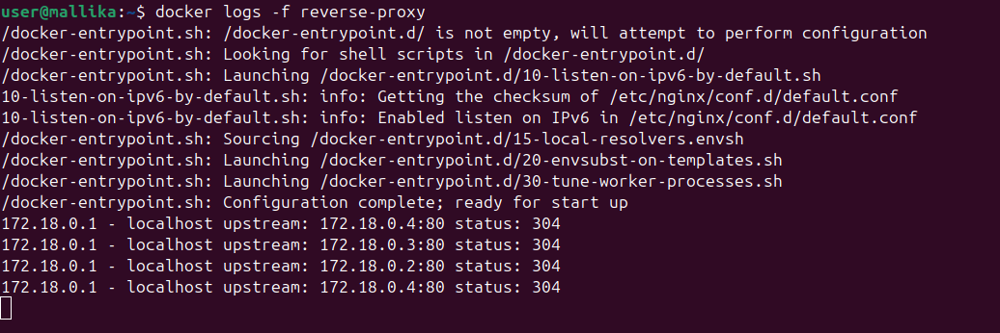

## nginx.conf

```bash
events {}

http {
    # Custom log format
    # Logs:
    # - Client IP
    # - Requested host
    # - Which upstream container handled the request
    # - Response status
    log_format upstreamlog '$remote_addr - $host '
                           'upstream: $upstream_addr '
                           'status: $status';

    access_log /var/log/nginx/access.log upstreamlog;

    # Define upstream backend group
    # Docker DNS "poc"
    # Docker automatically resolves it to ALL running containers
    upstream poc_backend {
        server poc:80;
    }

    server {
        listen 80;

        location / {
            # Forward all traffic to upstream group
            proxy_pass http://poc_backend/;

             # Preserve original Host header
            proxy_set_header Host $host;

            # Pass real client IP to backend
            proxy_set_header X-Real-IP $remote_addr;
        }
    }
}
```

## Docker Compose File

```bash
services:
  poc:
    build: ./templet-POC
    restart: always

  reverse-proxy:
    image: nginx:alpine
    container_name: reverse-proxy
    ports:
      - "4000:80"
    volumes:
      - ./reverse-proxy/nginx.conf:/etc/nginx/nginx.conf
    depends_on:
      - poc
    restart: always
```

Run this command to create 3 containers of *poc*
```bash
docker compose up -d --build --scale poc=3
```

## Nginx will load balance across these 3 poc containers


