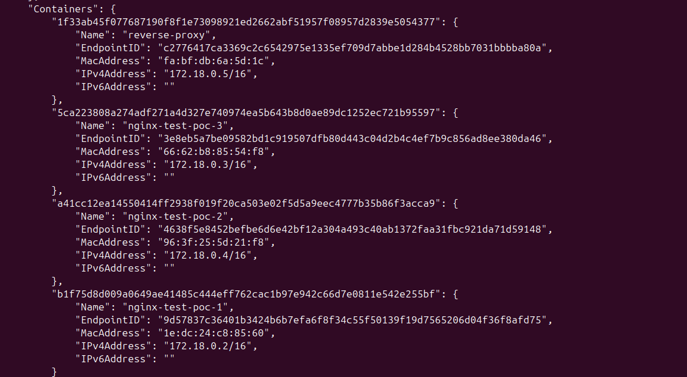

## Architecture
```bash
                         ┌───────────────────────────┐
                         │      Client / Browser     │
                         │   http://localhost:4000   │
                         └──────────────┬────────────┘
                                        │
                                        │  Port 4000
                                        ▼
                         ┌──────────────────────────┐
                         │     reverse-proxy        │
                         │      (nginx:alpine)      │
                         │        Port 80           │
                         └──────────────┬───────────┘
                                        │
                                        │ proxy_pass
                                        ▼
                         ┌──────────────────────────┐
                         │      upstream: poc       │
                         │      (Docker DNS)        │
                         └──────────────┬───────────┘
                                        │
              ┌─────────────────────────┼─────────────────────────┐
              ▼                         ▼                         ▼
   ┌──────────────────┐     ┌──────────────────┐     ┌──────────────────┐
   │ nginx-test-poc-1 │     │ nginx-test-poc-2 │     │ nginx-test-poc-3 │
   │    Port 80       │     │    Port 80       │     │    Port 80       │
   └──────────────────┘     └──────────────────┘     └──────────────────┘

```


## Network

